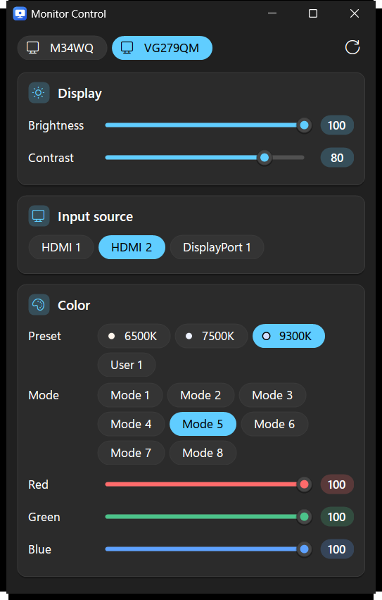

# Monitor Control

Control your monitors on Windows with this simple app.
It uses DDC protocol to allow you to change inputs without any external hardware.

## What it can do

- Adjust brightness and contrast
- Switch input source (HDMI, DisplayPort, USB-C...)
- Change color presets, picture modes and red/green/blue levels
- Control multiple monitors

## Tech

- C# with Windows Forms (.NET Framework 4)
- DDC/CI through the Windows monitor API (`dxva2.dll`)
- Built with `build.bat` using the C# compiler included with Windows
